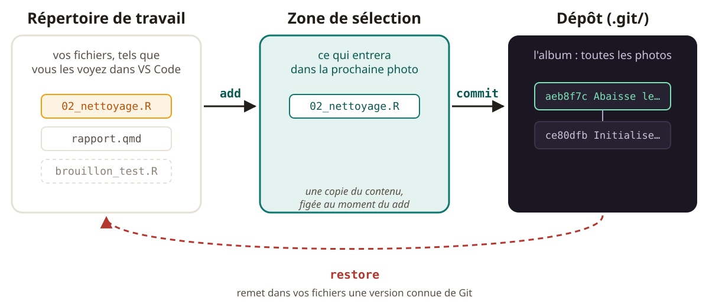
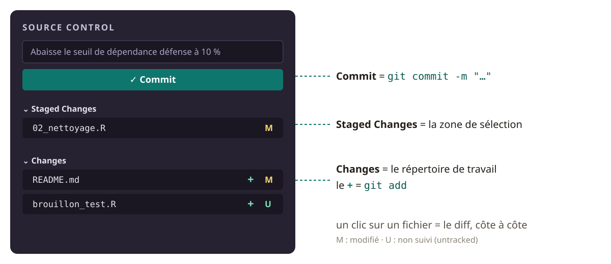
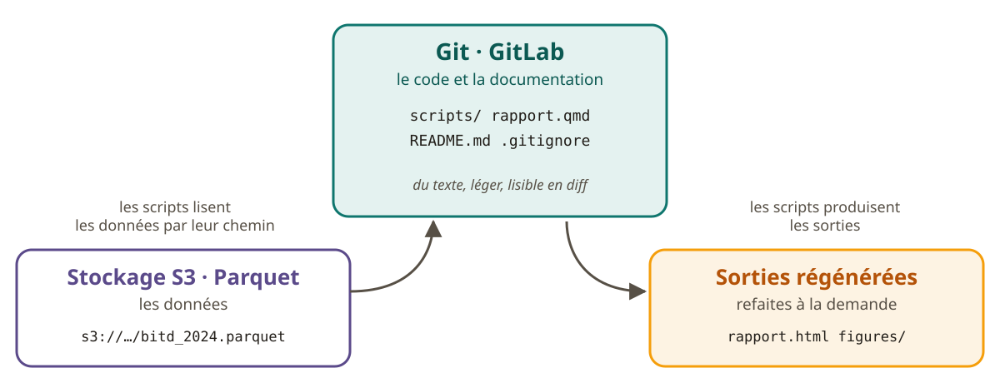
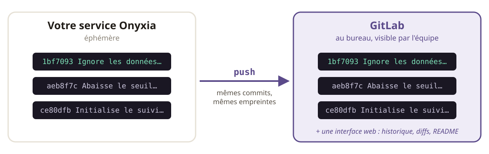

[Guide participant · à garder ouvert pendant l'atelier]{.eyebrow}

Ce guide suit l'atelier dans l'ordre. Chaque commande se copie d'un clic (icône en haut à droite des blocs). Sous chaque commande, vous trouverez la **sortie attendue** : ce que Git doit vous répondre. Les empreintes (les suites de 7 caractères comme `ce80dfb`) de *vos* commits seront différentes des nôtres ; celles de Marie seront identiques.

::: {.remember}
Ce soir, vous saurez **photographier** l'état exact de votre étude, avec le pourquoi ; **retrouver** la version de vendredi ; **partager** votre travail sur GitLab.
:::

## Avant de commencer

Ouvrez votre service VS Code sur Onyxia, puis le terminal intégré : menu **Terminal → Nouveau terminal**. Le kit doit avoir été lancé (voir [Avant l'atelier](prerequis.qmd)) ; sinon :

```bash
bash kit.sh
```

L'étude du soir s'appelle `entreprises_defense`. Elle est fictive : 40 entreprises inventées, liées à la défense. Marie, statisticienne, en est l'autrice ; Franck est son collègue.

```text
entreprises_defense/
├── README.md
├── rapport.qmd
├── brouillon_test.R
├── data/
│   └── entreprises_defense_2024.csv
└── scripts/
    ├── 01_import.R
    ├── 02_nettoyage.R
    └── 03_analyse.R
```

En Python (kit lancé avec `--python`), les scripts se terminent par `.py` ; les commandes Git sont les mêmes.

### Git vous parle en anglais

Dans les services Onyxia, Git s'exprime en anglais. Quatre phrases suffisent pour ce soir :

::: {.concept}
| Git dit… | … et cela veut dire |
|---|---|
| `nothing to commit, working tree clean` | Rien à photographier : tout est déjà dans la dernière photo |
| `Untracked files` | Fichiers que Git ne suit pas encore |
| `Changes not staged for commit` | Modifié, mais pas encore choisi pour la photo |
| `Changes to be committed` | Choisi : entrera dans la prochaine photo |
:::

## Temps 1 — Une version, c'est quoi ?

« Vendredi, mon script fonctionnait. » Pour s'en sortir, il faudrait l'**état exact** de l'étude vendredi, et savoir **ce qui a changé, par qui, et pourquoi**.

::: {.concept}
**L'image : la photo de l'album.** Chaque commit est une photo de *toute* l'étude, collée dans un album, avec une légende au dos : qui, quand, pourquoi.

**Sous le capot.** Un commit contient l'**instantané complet** de l'arborescence du projet (pas un diff), l'auteur, la date, le message, et un **lien vers le commit parent**. Il est identifié par une **empreinte** (SHA-1) calculée sur tout cela : changer un seul caractère donne une tout autre empreinte, donc un commit ne se modifie pas.

Les fichiers inchangés ne sont pas recopiés : Git retrouve un contenu identique par son empreinte. Et le diff n'est stocké nulle part : il est calculé à la demande, en comparant deux photos.
:::

Trois commits de Marie, bout à bout, forment une chaîne — chacun pointe vers son parent :

```text
81bd623  ←  3d6a872  ←  af989d8
Initialise   Ajoute       Ne garde que
l'étude      l'import     les entreprises…
```

::: {.remember}
Un commit = une photo complète + un message + un lien vers la précédente.
:::

## Temps 2 — Le geste

Placez-vous dans le dossier de l'étude :

```bash
cd ~/atelier-git/entreprises_defense
```

::: {.concept}
**L'image : la table de sélection.** Avant de coller des photos dans l'album, on les pose sur une table : on choisit lesquelles entrent. Puis, d'un geste, on colle toute la sélection.

**Sous le capot : trois zones.**

{fig-alt="Le répertoire de travail, la zone de sélection et le dépôt, reliés par les flèches add, commit et restore."}

- le **répertoire de travail** : vos fichiers, tels que vous les voyez dans VS Code ;
- la **zone de sélection** (l'*index*, dans la documentation de Git) : ce qui entrera dans la prochaine photo ;
- le **dépôt**, le dossier caché `.git/` : l'album.

`git add` copie le **contenu du fichier à cet instant** dans la mémoire de Git et l'inscrit dans la sélection. Il fige donc **une version**, pas un fichier : si vous modifiez le fichier après, il faut refaire `git add`.
:::

### Étape 1 : la première photo

En binôme : un pilote au clavier, un copilote qui **prédit la réponse avant chaque `git status`**.

::: {.try}
```bash
git init
git status
git add README.md scripts/ rapport.qmd
git status
git commit -m "Initialise le suivi de l'étude entreprises_defense"
git status
```
:::

::: {.terminal-demo data-title="entreprises_defense"}
```bash
git init
```

```text
Initialized empty Git repository in /home/onyxia/atelier-git/entreprises_defense/.git/
```
:::

::: {.terminal-demo data-title="entreprises_defense"}
```bash
git status
```

```text
On branch main

No commits yet

Untracked files:
  (use "git add <file>..." to include in what will be committed)
	README.md
	brouillon_test.R
	data/
	rapport.qmd
	scripts/

nothing added to commit but untracked files present (use "git add" to track)
```
:::

::: {.terminal-demo data-title="entreprises_defense"}
```bash
git add README.md scripts/ rapport.qmd
git status
```

```text
On branch main

No commits yet

Changes to be committed:
  (use "git rm --cached <file>..." to unstage)
	new file:   README.md
	new file:   rapport.qmd
	new file:   scripts/01_import.R
	new file:   scripts/02_nettoyage.R
	new file:   scripts/03_analyse.R

Untracked files:
  (use "git add <file>..." to include in what will be committed)
	brouillon_test.R
	data/
```
:::

Le CSV et le brouillon restent dehors : **tout ne mérite pas la photo**.

::: {.terminal-demo data-title="entreprises_defense"}
```bash
git commit -m "Initialise le suivi de l'étude entreprises_defense"
```

```text
[main (root-commit) ce80dfb] Initialise le suivi de l'étude entreprises_defense
 5 files changed, 114 insertions(+)
 create mode 100644 README.md
 create mode 100644 rapport.qmd
 create mode 100644 scripts/01_import.R
 create mode 100644 scripts/02_nettoyage.R
 create mode 100644 scripts/03_analyse.R
```
:::

::: {.terminal-demo data-title="entreprises_defense"}
```bash
git status
```

```text
On branch main
Untracked files:
  (use "git add <file>..." to include in what will be committed)
	brouillon_test.R
	data/

nothing added to commit but untracked files present (use "git add" to track)
```
:::

### Étape 2 : changer le seuil

Échangez les rôles. Dans VS Code, ouvrez `scripts/02_nettoyage.R`, passez `seuil_dependance` de `0.20` à `0.10`, et enregistrez (en Python : `seuil_dependance = 0.20` dans `scripts/02_nettoyage.py`).

::: {.try}
```bash
git status
git diff
git add scripts/02_nettoyage.R
git diff --staged
git commit -m "Abaisse le seuil de dépendance défense à 10 %"
git log --oneline
```
:::

::: {.terminal-demo data-title="entreprises_defense"}
```bash
git status
```

```text
On branch main
Changes not staged for commit:
  (use "git add <file>..." to update what will be committed)
  (use "git restore <file>..." to discard changes in working directory)
	modified:   scripts/02_nettoyage.R

Untracked files:
  (use "git add <file>..." to include in what will be committed)
	brouillon_test.R
	data/

no changes added to commit (use "git add" and/or "git commit -a")
```
:::

::: {.terminal-demo data-title="entreprises_defense"}
```bash
git diff
```

```text
diff --git a/scripts/02_nettoyage.R b/scripts/02_nettoyage.R
index 9145786..1be6bec 100644
--- a/scripts/02_nettoyage.R
+++ b/scripts/02_nettoyage.R
@@ -1,7 +1,7 @@
 # Nettoyage : ne garder que les entreprises dépendantes de la défense
 source("scripts/01_import.R")

-seuil_dependance <- 0.20
+seuil_dependance <- 0.10

 entreprises <- entreprises_brut |>
   # Un même SIREN ne doit compter qu'une fois
```
:::

La ligne `-` est l'ancienne version, la ligne `+` la nouvelle ; les autres lignes sont du contexte. Après `git add`, `git diff` ne montre plus rien, et c'est `git diff --staged` qui affiche ce qui entrera dans la photo (la même sortie que ci-dessus).

::: {.terminal-demo data-title="entreprises_defense"}
```bash
git commit -m "Abaisse le seuil de dépendance défense à 10 %"
git log --oneline
```

```text
[main aeb8f7c] Abaisse le seuil de dépendance défense à 10 %
 1 file changed, 1 insertion(+), 1 deletion(-)
aeb8f7c (HEAD -> main) Abaisse le seuil de dépendance défense à 10 %
ce80dfb Initialise le suivi de l'étude entreprises_defense
```
:::

`(HEAD -> main)` signifie : « vous êtes ici », sur le dernier commit de votre branche.

### La même chose, avec des cases à cocher

Le panneau **Source Control** de VS Code (icône de branche dans la barre de gauche) montre les deux zones : *Changes* (modifié, pas encore choisi) et *Staged Changes* (la sélection). Le `+` à côté d'un fichier fait un `git add` ; un clic sur un fichier affiche le diff côte à côte. C'est pratique, mais **la commande reste la référence** : en cas de doute, `git status` dit la vérité.

{fig-alt="Schéma du panneau Source Control de VS Code : Staged Changes est la zone de sélection, Changes le répertoire de travail, le bouton plus fait git add."}

### Trois pièges

::: {.warning}
**Commit sans `add`.** Rien n'était sur la table : Git refuse, et le dit.

```text
$ git commit -m "Ajoute une note de relecture"
On branch main
Changes not staged for commit:
  (use "git add <file>..." to update what will be committed)
  (use "git restore <file>..." to discard changes in working directory)
	modified:   README.md

Untracked files:
  (use "git add <file>..." to include in what will be committed)
	brouillon_test.R
	data/

no changes added to commit (use "git add" and/or "git commit -a")
```
:::

::: {.warning}
**Modifier après `add`.** Le fichier apparaît **dans les deux listes** : une version choisie, une version plus récente. Refaites `git add` pour choisir la plus récente, ou retirez le fichier de la sélection avec `git restore --staged <fichier>`.

```text
$ git status
On branch main
Changes to be committed:
  (use "git restore --staged <file>..." to unstage)
	modified:   README.md

Changes not staged for commit:
  (use "git add <file>..." to update what will be committed)
  (use "git restore <file>..." to discard changes in working directory)
	modified:   README.md
```
:::

::: {.warning}
**Le message « modif ».** Un message de commit s'écrit **du point de vue de l'étude**, **à l'impératif**, pour la personne qui lira dans **trois mois**. Pas « modif », « update » ou « v2 », mais : « Abaisse le seuil de dépendance défense à 10 % ». Il se lit comme la suite de « Ce commit… ».
:::

::: {.concept}
**L'éditeur s'est ouvert ?** Si vous oubliez `-m "…"`, Git ouvre un éditeur de texte dans le terminal. Pour en sortir sans rien enregistrer : `Échap`, puis `:q!`, puis `Entrée`. Recommencez avec `-m`.
:::

::: {.remember}
Regarder, choisir, enregistrer. Et `git status` ne casse jamais rien.
:::

## Temps 3 — Vendredi, ça marchait

Marie est absente. Le graphique est passé en pourcentages, personne ne sait pourquoi. Et depuis lundi, `03_analyse.R` ne tourne plus. On travaille dans l'étude de Marie :

```bash
cd ~/atelier-git/entreprises_defense_marie
```

::: {.concept}
**L'image : feuilleter l'album.** On ouvre l'album à la dernière page et on remonte, en lisant les légendes.

**Sous le capot.** `git log` part de « où je suis » — le dernier commit de la branche courante — et remonte la chaîne des parents. `git show <empreinte>` affiche la légende (auteur, date, message) et le **diff avec le parent**, calculé à la volée. Sept caractères de l'empreinte suffisent : ils sont uniques dans le dépôt.
:::

::: {.try}
**L'enquête.** Trouvez le commit qui a fait passer le graphique en parts : qui, quand, pourquoi ? Puis celui qui a cassé le script.

```bash
git log --oneline
git show <empreinte>
```
:::

::: {.terminal-demo data-title="entreprises_defense_marie"}
```bash
git log --oneline
```

```text
24e5e4a (HEAD -> main) Met à jour le rapport avec les résultats 2024
b0b1445 Ajoute la ventilation par secteur d'activité (NAF)
155ae9a Passe le graphique des effectifs en parts (%) à la demande du chef de bureau
456a938 Corrige le calcul du CA défense (doublons de SIREN)
842a418 Ajoute la ventilation par taille d'entreprise (PME, ETI, GE)
af989d8 Ne garde que les entreprises dont la part de CA défense dépasse 20 %
3d6a872 Ajoute l'import de l'extrait entreprises_defense_2024
81bd623 Initialise l'étude des entreprises liées à la défense
```
:::

::: {.concept}
**`git show` affiche `:` ou `(END)` en bas de l'écran ?** C'est le lecteur de texte de Git : les flèches font défiler, `q` fait quitter.
:::

<details>
<summary>La solution de l'enquête</summary>

Le passage en parts, c'est `155ae9a` : Marie, le vendredi 11 septembre à 17 h 20, « à la demande du chef de bureau ».

::: {.terminal-demo data-title="entreprises_defense_marie"}
```bash
git show 155ae9a
```

```text
commit 155ae9a6e9d9be8237c6c7b5e152b26f5a022187
Author: Marie <marie@exemple.fr>
Date:   Fri Sep 11 17:20:00 2026 +0200

    Passe le graphique des effectifs en parts (%) à la demande du chef de bureau

diff --git a/scripts/03_analyse.R b/scripts/03_analyse.R
index 89ac875..7e2325b 100644
--- a/scripts/03_analyse.R
+++ b/scripts/03_analyse.R
@@ -3,14 +3,16 @@ source("scripts/02_nettoyage.R")
 library(ggplot2)

 effectifs_taille <- entreprises |>
-  count(taille, name = "effectifs")
+  count(taille, name = "effectifs") |>
+  mutate(part = effectifs / sum(effectifs))

-graphique <- ggplot(effectifs_taille, aes(x = taille, y = effectifs)) +
+graphique <- ggplot(effectifs_taille, aes(x = taille, y = part)) +
   geom_col(fill = "#0f766e") +
+  scale_y_continuous(labels = scales::percent) +
   labs(
     title = "Entreprises liées à la défense, par taille",
     x = NULL,
-    y = "Nombre d'entreprises"
+    y = "Part des entreprises"
   )

 dir.create("figures", showWarnings = FALSE)
```
:::

Le script cassé, c'est `b0b1445`, le lundi 14 septembre : il ajoute un `group_by(secteur)`, mais la colonne `secteur` n'existe pas dans les données.

::: {.terminal-demo data-title="entreprises_defense_marie"}
```bash
git show b0b1445
```

```text
commit b0b1445b986bec6278113229a4c5b64e30c17b89
Author: Marie <marie@exemple.fr>
Date:   Mon Sep 14 09:05:00 2026 +0200

    Ajoute la ventilation par secteur d'activité (NAF)

diff --git a/scripts/03_analyse.R b/scripts/03_analyse.R
index 7e2325b..086502d 100644
--- a/scripts/03_analyse.R
+++ b/scripts/03_analyse.R
@@ -6,6 +6,11 @@ effectifs_taille <- entreprises |>
   count(taille, name = "effectifs") |>
   mutate(part = effectifs / sum(effectifs))

+# Ventilation par secteur d'activité (NAF)
+effectifs_secteur <- entreprises |>
+  group_by(secteur, taille) |>
+  summarise(effectifs = n(), .groups = "drop")
+
 graphique <- ggplot(effectifs_taille, aes(x = taille, y = part)) +
   geom_col(fill = "#0f766e") +
   scale_y_continuous(labels = scales::percent) +
```
:::

Et si Marie avait écrit « modif » à chaque fois ? Il faudrait ouvrir les huit commits un par un.

</details>

### Revenir : deux besoins, deux commandes

- **J'ai modifié un fichier, je regrette, rien n'est commité** : `git restore <fichier>`.
- **Je veux la version de vendredi d'un fichier** : `git restore --source=<empreinte> <fichier>`.

::: {.concept}
**Sous le capot.** Par défaut, `git restore <fichier>` reprend la version de la **zone de sélection** ; si rien n'y est, celle du **dernier commit**. C'est **destructif** pour tout ce qui n'a pas été confié à Git : la modification effacée ne se retrouve nulle part.
:::

::: {.try}
**1. La dernière photo.** Modifiez une ligne de `README.md` dans VS Code, enregistrez, puis :

```bash
git status
git restore README.md
git status
```

Regardez `README.md` dans VS Code : votre modification a disparu.
:::

::: {.terminal-demo data-title="entreprises_defense_marie"}
```bash
git status
```

```text
On branch main
Changes not staged for commit:
  (use "git add <file>..." to update what will be committed)
  (use "git restore <file>..." to discard changes in working directory)
	modified:   README.md

Untracked files:
  (use "git add <file>..." to include in what will be committed)
	.Renviron
	.Rhistory
	data/bitd_2024.parquet
	donnees_entreprises_confidentiel.xlsx
	figures/
	notes_reunion_chef_de_bureau.md
	rapport.html

no changes added to commit (use "git add" and/or "git commit -a")
```
:::

::: {.try}
**2. La version de vendredi.** On reprend `03_analyse.R` tel qu'il était au commit `155ae9a`, on vérifie, et on enregistre ce retour par un nouveau commit qui explique le pourquoi :

```bash
git restore --source=155ae9a scripts/03_analyse.R
git status
git diff
git add scripts/03_analyse.R
git commit -m "Revient au script d'analyse de vendredi (la ventilation NAF cassait le script)"
```

En Python : `scripts/03_analyse.py`, et le commit de vendredi est `693c70a`.
:::

::: {.terminal-demo data-title="entreprises_defense_marie"}
```bash
git diff
```

```text
diff --git a/scripts/03_analyse.R b/scripts/03_analyse.R
index 086502d..7e2325b 100644
--- a/scripts/03_analyse.R
+++ b/scripts/03_analyse.R
@@ -6,11 +6,6 @@ effectifs_taille <- entreprises |>
   count(taille, name = "effectifs") |>
   mutate(part = effectifs / sum(effectifs))

-# Ventilation par secteur d'activité (NAF)
-effectifs_secteur <- entreprises |>
-  group_by(secteur, taille) |>
-  summarise(effectifs = n(), .groups = "drop")
-
 graphique <- ggplot(effectifs_taille, aes(x = taille, y = part)) +
   geom_col(fill = "#0f766e") +
   scale_y_continuous(labels = scales::percent) +
```
:::

::: {.terminal-demo data-title="entreprises_defense_marie"}
```bash
git commit -m "Revient au script d'analyse de vendredi (la ventilation NAF cassait le script)"
```

```text
[main e433f7d] Revient au script d'analyse de vendredi (la ventilation NAF cassait le script)
 1 file changed, 5 deletions(-)
```
:::

L'historique reste intact : le commit de lundi est toujours là. On n'a pas réécrit le passé, on a ajouté une page qui le corrige.

::: {.warning}
Vous croiserez sur internet d'autres commandes pour « revenir en arrière ». Ce soir, une seule : `restore`.
:::

::: {.remember}
Git ne peut retrouver que ce qu'on lui a confié. Avant de bidouiller : commit.
:::

## Temps 4 — Ce qui a sa place dans le dépôt

Chez Marie, `git status` liste des fichiers que personne n'a jamais regardés. Faut-il tout ajouter ?

::: {.terminal-demo data-title="entreprises_defense_marie"}
```bash
git status
```

```text
On branch main
Untracked files:
  (use "git add <file>..." to include in what will be committed)
	.Renviron
	.Rhistory
	data/bitd_2024.parquet
	donnees_entreprises_confidentiel.xlsx
	figures/
	notes_reunion_chef_de_bureau.md
	rapport.html

nothing added to commit but untracked files present (use "git add" to track)
```
:::

Pour trier, quatre questions : **texte ou binaire ? régénérable ou non ? secret (un jeton) ? secret statistique (des données individuelles) ?**

::: {.concept}
**Sous le capot.** Git garde chaque version de chaque fichier suivi, **pour toujours** : un binaire de 600 Mo modifié dix fois, ce sont dix copies, et sans diff lisible. Un secret commité **reste dans l'historique**, même après la suppression du fichier. Et les données individuelles d'entreprises relèvent du **secret statistique**.

L'architecture cible : le code et la documentation dans Git ; les données sur le stockage S3, en Parquet, lues par leur chemin ; les sorties régénérées à la demande.

{fig-alt="Le code et la documentation dans Git, les données sur S3 au format Parquet lues par leur chemin, les sorties régénérées par les scripts."}
:::

<details>
<summary>Pour aller plus loin</summary>

`.gitignore` n'agit pas sur un fichier **déjà suivi** : il faut d'abord le retirer du suivi, sans le supprimer du disque. C'est hors programme ce soir.

</details>

::: {.try}
Revenez dans **votre** étude :

```bash
cd ~/atelier-git/entreprises_defense
```

Tapez `git status` pour voir la situation. Puis, dans VS Code, créez à la racine du dossier un fichier nommé `.gitignore` (le point au début compte), contenant :

```bash
data/
*.html
.Rhistory
.Renviron
figures/
```

Enregistrez, puis :

```bash
git status
git add .gitignore
git commit -m "Ignore les données, les sorties et les fichiers d'environnement"
```
:::

::: {.terminal-demo data-title="entreprises_defense"}
```bash
git status
```

```text
On branch main
Untracked files:
  (use "git add <file>..." to include in what will be committed)
	.gitignore
	brouillon_test.R

nothing added to commit but untracked files present (use "git add" to track)
```
:::

`data/` a disparu de la liste ; `.gitignore` y apparaît, prêt à être commité.

::: {.remember}
Git est fait pour le texte. Pas pour les données.
:::

## Temps 5 — Partager sur GitLab

Votre service Onyxia est **éphémère** : si vous le supprimez, `entreprises_defense/` disparaît avec ses photos. Et Franck ne voit rien.

::: {.concept}
**L'image.** L'album reste chez vous ; GitLab, c'est l'exemplaire déposé au bureau, que tout le monde peut feuilleter.

**Sous le capot.** Git ≠ GitLab. GitLab héberge **une copie du dépôt** — mêmes commits, mêmes empreintes — plus une interface web (historique, diffs, README affiché). `origin` est un surnom local pour l'adresse du dépôt distant. `git push` envoie les commits que GitLab n'a pas encore, et ne change rien chez vous ; `-u` mémorise le lien entre votre branche `main` et celle de GitLab. Le jeton, injecté par Onyxia, est votre identité auprès de GitLab.

{fig-alt="Le dépôt dans le service Onyxia et sa copie sur GitLab, avec les mêmes commits et les mêmes empreintes."}
:::

::: {.try}
**Dans GitLab** ([]()) :

1. **Nouveau projet** → **Créer un projet vide** ;
2. nom : `entreprises-defense-<prénom>`, visibilité **privée** ou **interne** ;
3. **décochez « Initialiser le dépôt avec un README »** ;
4. copiez l'adresse du projet (bloc **Push an existing folder**).

**Dans le terminal**, à la racine d'`entreprises_defense/` :

```bash
git remote add origin /<prénom>/entreprises-defense-<prénom>.git
git push -u origin main
```

Puis rafraîchissez la page GitLab : ouvrez l'historique, cliquez sur un commit, lisez son diff, et regardez le README affiché sur l'accueil du projet.
:::

::: {.terminal-demo data-title="entreprises_defense"}
```bash
git push -u origin main
```

```text
Enumerating objects: 15, done.
Counting objects: 100% (15/15), done.
Delta compression using up to 4 threads
Compressing objects: 100% (14/14), done.
Writing objects: 100% (15/15), 2.82 KiB | 2.82 MiB/s, done.
Total 15 (delta 4), reused 0 (delta 0), pack-reused 0
To /camille/entreprises-defense-camille.git
 * [new branch]      main -> main
branch 'main' set up to track 'origin/main'.
```
:::

::: {.warning}
**Le projet a été créé avec un README ?** Le premier push est refusé, car GitLab contient un commit que vous n'avez pas :

```text
 ! [rejected]        main -> main (fetch first)
error: failed to push some refs to '/camille/entreprises-defense-camille.git'
```

Ce soir, on ne dépanne pas : supprimez le projet dans GitLab, recréez-le **sans README** avec le même nom, et relancez `git push -u origin main`.
:::

::: {.warning}
**Git demande un mot de passe, ou le push échoue ?** Le jeton est absent ou expiré : vérifiez *Mon compte* sur Onyxia, puis relancez un service. En attendant, suivez à l'écran de la formatrice.
:::

::: {.remember}
`commit` enregistre chez moi. `push` rend visible chez nous.
:::

## Clôture

Le tableau de la soirée, à garder sous la main (aussi en [page mémo](memo.qmd) et en [version imprimable](materiel/memo.pdf)) :



::: {.try}
**Le défi de la semaine.** Mettez une vraie étude en cours sous Git : **trois commits, un push**. L'atelier 2 s'ouvrira sur : « Franck reprend votre étude ».
:::
